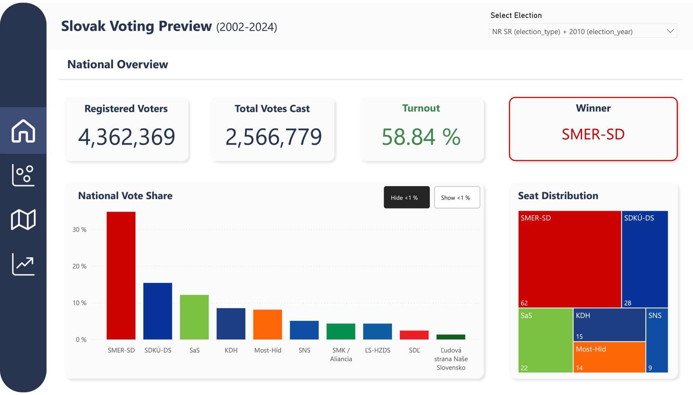
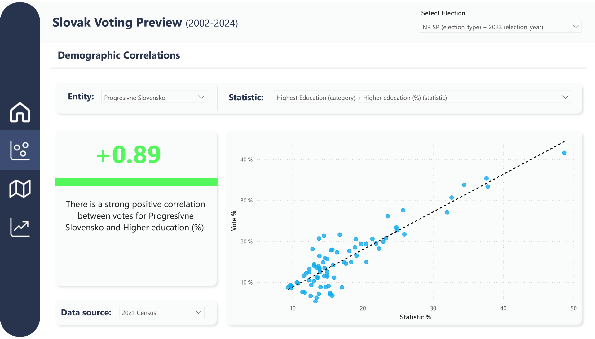
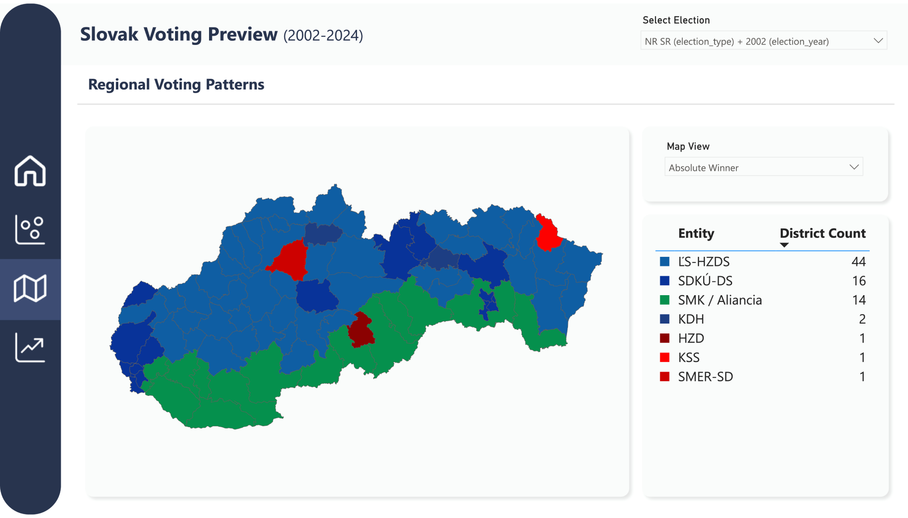
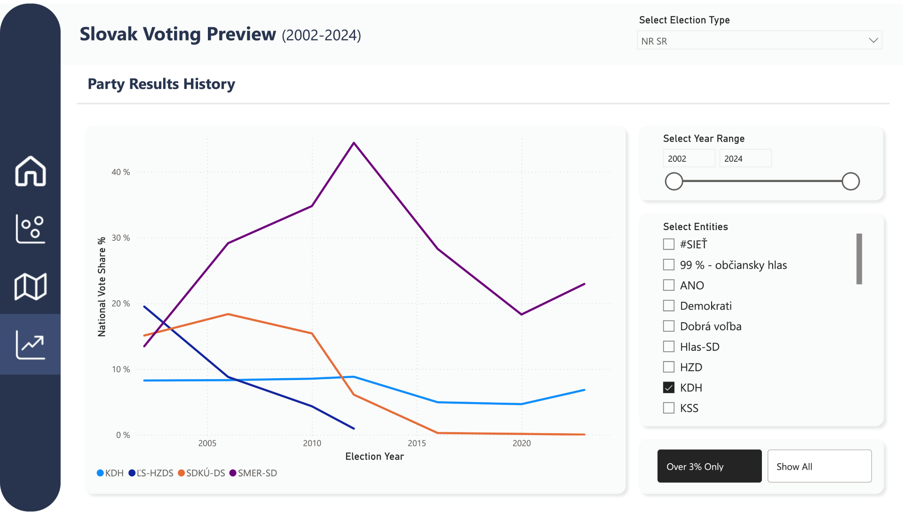

# Interactive Election Map: Slovak Republic


This project is an extension of my [2025 Slovak Geography Olympiad entry](https://matusbolecek.com/#expand-geo), which was focused on Electoral Geography in Slovakia. This repository hosts the modular data engineering pipeline and necessary files for running my publicly available **[Interactive Election Map](https://matusbolecek.com/voting)**. 

While the main goal is mapping historical elections and demographics in Slovakia, the underlying Python pipeline was built to be highly extensible. It can be easily adapted to process and visualize electoral data for any country.

## Getting started
The repository includes a fully automated Python pipeline that ingests raw historical data, cleans it, standardizes it, and outputs analysis-ready datasets.

### Prerequisites & Installation
1. Clone this repository to your local machine.
2. Install the required Python packages:
```bash
pip install -r requirements.txt
```

### Running the Data Pipeline
To build the datasets from scratch, simply run the main build script:
```bash
python build.py
```
This script will parse the raw `.xls`/`.xlsx`/`.csv` files in the `data/` directory, apply the necessary transformations defined in `processing.py`, and generate completed `.csv` files in the `out/` directory.

## Dashboard Features

### Page 1: Overview


The first page provides a macro-level overview of each election. It displays the registered voters, total votes, and turnout, and highlights the winner. Furthermore, it displays the results of all parties on a bar chart and calculates the parliamentary seat distribution for parties that reach the required 5% threshold.

### Page 2: Correlations


This page allows for easy comparison between regional demographic statistics (e.g., education level, age groups, urbanization) and a party's performance in specific districts. It visualizes this on a scatter plot and automatically calculates the Pearson's correlation coefficient alongside a brief, automated interpretation.

### Page 3: Map


An interactive TopoJSON map allowing for spatial visualization of the election results. The map supports two distinct views:
1. **Absolute Winner:** Standard choropleth showing which party won the district.
2. **Positive Deviation from Mean:** A standard electoral geography metric used to uncover regional strongholds by showing where a party overperformed relative to its national average.

### Page 4: Trends 


The final page is focused on time-series analysis, tracking a party's performance over two decades. A dynamic line chart compares selected parties against each other, with the timeline and visible entities fully controllable via custom slicers.

## Technical Architecture
The entire project was built with extensibility in mind and is strictly object-oriented and modular:

* **Data Wrangling (`processing.py`)**: Utilizes `pandas` to clean inconsistent statistical data - the format has changed multiple times in the case of Slovakia. It handles wide-to-long format melting, regex-based string cleaning, and null-value handling for different election formats (National vs. European).
* **Pipeline Orchestration (`build.py`)**: Uses a `Dimension` base class to orchestrate the building of analytical tables (`DimResults`, `DimDemography`, `DimParties`, `DimDistricts`), creating a clean Star Schema ready for BI tools or a custom web frontend.
* **Party Name Unification**: Party names often change. The pipeline uses mapping dictionaries to unify political entities for accurate time-series analysis.

## Data Sources
* **Election Data**: Mirrored from the Statistical Office of the Slovak Republic ([volby.statistics.sk](https://volby.statistics.sk/index-en.html)).
* **Demographic Data**: Sourced from the 2021 Slovak National Census ([scitanie.sk](https://www.scitanie.sk/en)). 
* **Geospatial Data**: The TopoJSON file used for the map boundaries is provided by the Geodesy, Cartography and Cadastre Authority of the Slovak Republic ([available here](https://hub.arcgis.com/datasets/400fb27a963b43ae8134cd16aad8dcf8_0/about)).
* **UI Assets**: Navigation bar icons utilize the open-source FluentUI System Icons by Microsoft ([GitHub link](https://github.com/microsoft/fluentui-system-icons)).